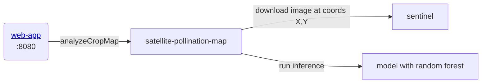

## gratheon/satellite-pollination-map
Given apiary/hive coordinates X,Y,time
this microservice is fetching raw map data from Copernicus,
then runs segmentation and classification

https://documentation.dataspace.copernicus.eu/APIs/SentinelHub/Overview/Authentication.html#python

### URLs
- Dev: http://localhost:9500

## Architecture

### ML model 
Trained on CASSINI image dataset + markup of PRIA polygon data for fields + MAAAMET for forests
See [vegetation_classificator.ipynb](./vegetation_classificator.ipynb)