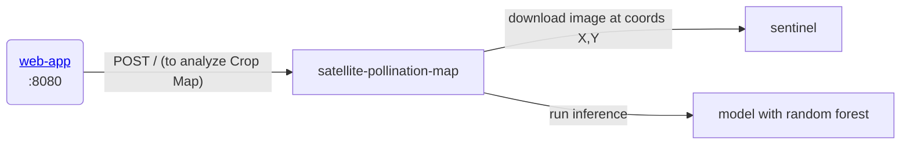

## gratheon/satellite-pollination-map
Given apiary/hive coordinates X,Y,time
this microservice is fetching raw map data from Copernicus,
then runs segmentation and classification


To get CASSINI token, you need to:
- [login/register into copernicus](https://identity.dataspace.copernicus.eu/auth/realms/CDSE/protocol/openid-connect/auth?client_id=cdse-public&response_type=code&scope=openid&redirect_uri=https%3A//dataspace.copernicus.eu/account/confirmed/1)
- [go to hub dashboard](https://shapps.dataspace.copernicus.eu/dashboard/#/)
- [generate oauth token](https://shapps.dataspace.copernicus.eu/dashboard/#/account/settings)
- Use tokens in code (cfg.py) as described in [API](https://documentation.dataspace.copernicus.eu/APIs/SentinelHub/Overview/Authentication.html#python)


### URLs
- Dev: http://localhost:9500
- Prod: http://satellite.gratheon.com


## Architecture



## Development
You can run service natively
```
pip install -f requirements.txt
python server.py
```

Or you can run it as a docker container
```
docker-compose -f docker-compose.dev.yml up
```

### ML model 
Trained on CASSINI image dataset + markup of PRIA polygon data for fields + MAAAMET for forests
See [vegetation_classificator.ipynb](./vegetation_classificator.ipynb)